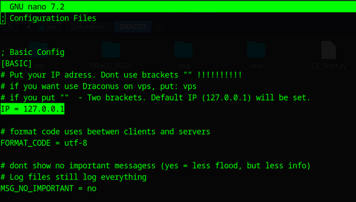

<div id="Intro">
  <h1 align="center">DRACONUS</h1>
  <p align="center">
    
  </p>
  <p align="center">
    <h3> This code does NOT promote or encourage any illegal activities! The content of this document is for educational purposes only, intended to raise awareness and learn the Python language and in particular the socket module </h3>
    <h3> May this be a warning to both you and your family. Don't download software that you don't trust. Only download software from reputable software developers and those you trust.</h3>
  </p>

</div>

<br/>
<br/>

<div id="toc">
  <h2 align="center">Contents</h2>
  <div align="center">
    <a href="#Intro">Intro</a> &nbsp;|&nbsp;
    <a href="#About">About</a> &nbsp;|&nbsp;
    <a href="#Whatis">What is Draconus</a>  &nbsp;|&nbsp;
    <a href="#How_works">How Works</a>  &nbsp;|&nbsp;
    <br/>
    <h3><a href="#LetsPlay">Let's Play</a></h3>
    <a href="#before">Before Start</a>  &nbsp;|&nbsp;
    <a href="#install">instalation</a>  &nbsp;|&nbsp;
  </div>
</div>


<br/>
<br/>

<div id="About" align="center">
    <h2 allign="center"> ABOUT </h2>
    <h5> I created this project primarily to gain a better understanding of how network sockets work in Python, and also as a fun exploration of Processes and Threads. After many, many... hours of work and testing with network sockets, I can only say one thing: "You can get a serious brain workout!" 😄 </h5>
    <h5> However, it seems to me that I've managed to create servers and clients that, to some extent, can work together (recover connections, avoid hanging, etc.). Nevertheless, strange "things" can still happen, and network sockets may behave in quite peculiar ways. </h5>
    <h5> In any case, I invite you to test and improve this project, as someone else might be able to tame those "network sockets." Good luck!</h5>
    <h5> After many hours of testing, arranging logic, etc., I experienced a 'brain freeze' The problem turned out to be the 'selectors' module, which could hang the socket in a few strange cases. I removed it from the project, and now clients can disconnect, reconnect, and the chance of hanging is very slim. This also applies to servers, which can now enable 'listening', turn it off, and recover connections without any problems.
The 'selectors' module has made it onto my blacklist </h5>
  </div>

<br/>
<br/>

<div id="Whatis" align="center">
    <h2 align="center"> What is "Draconus"? </h2>
    <h5> Draconus is a background-running program. Through another program called "Command Center," we connect to Draconus. Draconus enables the creation of various types of servers. These servers run as separate processes in the background but remain dependent on Draconus. As long as Draconus is running, all servers created by us will keep running.</h5>  
    <h5> The advantage of this setup is that you can safely disconnect from Draconus (using the Command Center), and it will continue to run alongside the servers as "Daemon Processes" in the system. </h5>  
    <h5> Draconus allows you to create an unlimited number of servers (I mean, I didn't introduce any limitations) until your CPU explodes! 😄 Each server is capable of handling connections from multiple clients simultaneously, managing those connections, receiving and sending messages or commands. Feel free to test the endurance of the servers, i.e., how many clients they can handle simultaneously and communicate with.</h5>  
    <h5> You're welcome to test and see how robust these servers are! </h5>
</div>

<div id="How_works">
  <br/>
  <h2 align="center"> How Draco Works </h2>
  <p>Due to its nature, Draconus operates exclusively on the Linux operating system. Because of its use of the Python `multiprocessing` module, this program may not function properly on Windows. However, client-type programmes are mainly designed for Windows. Some simple version (like EchoClient, BasicRat, BasicBot) should work on any platform that has python.<p>
  <p>You can easily compile 'client' type programs (Worms) into EXE format using 'auto-py-to-exe'. Many of them only use standard Python libraries. If the client requires additional libraries for installation, a file with the necessary requirements will be included.</p>

  <p>To run Draconus, you execute it as a background process (e.g., by using the "nohup" command). Draconus and every server it creates run continuously in the background as separate processes, each having its own log file.</p>


<p> **Each server has its own separate log file** and features a "Messenger" responsible for communication with users and logging server events. When working with Draconus, you can see its messages and those of the servers in real-time (courtesy of Messenger). When you disconnect from Draconus, Messenger continues to log messages to the file while buffering them. Upon reconnecting to Draconus, you'll receive all the pending messages that have accumulated since your last connection.</p>
<p>Therefore, even when you're not currently connected to Draconus, you can review messages and events by examining the continuously updated log file.</p>
<p>With Draconus, you connect using the Command Center. Command Center makes use of the "click" and "click-shell" libraries, providing you with a command-line interface with commands, parameters, and help. The console has two levels. The first level is where you interact with Draconus, creating servers, starting, closing, exporting, and performing other actions. The second console level operates after connecting to a previously created server. Each server may have slightly different commands, depending on its specifications (a "help" command is always available with a list of commands). From this level, you can also send messages and commands to connected clients on the server.</p>
<p>Draconus generates ready-to-use clients for each server; all you need to do is start them. Messages sent between clients and the server are not yet fully encrypted (I'm working on it), and they currently undergo a simple message format transformation to "Base64." Special messages are additionally padded with randomly generated character strings (similar to headers) to confuse potential eavesdroppers. Of course, everything is configurable, but if you don't want to delve into the details, you don't have to. Draconus is designed to work very well with default settings. The only thing you need to set in the configuration is your IP address, which can be found in the "CONFIG.ini" file.</p>
<p>Draconus can also be started as a regular program using the command "python3 Draconus.py." In this case, you'll need to open a second terminal to run the "Command Center."</p>

</div>

<div id="LetsPlay">
  <h2 align="center"> Let's Play</h2>
</div>

<div id="before" align="center">
  <h2>Before Start</h2>
  <p><b>I STRONGLY RECOMMENDED: Uses Draconus and clients only in Virtual Machine. You can serious DAMAGE your System</b></p>
  <p>Some Clients can perform unauthorized port scan, "http_flood" and other attack. YOU ARE RESPONSIBLE FOR USING THIS TOOL CORRECTLY !!!</p>
  <p>Don't attack other users' sites or infect their systems !!!!</p>
</div>

<br/>

<div id="install">
  <h2 align="center">Installation</h2>

  **Basic Requirements:**

- Linux Operating System (tested on Parrot and Kali)
- Python 3.11.2

1. Clone the repo
   ```sh
   git clone https://github.com/LittleAtariXE/Draconus
   ```
2. Change directory
   ```sh
   cd Draconus
   ```
3. Install requirements
   ```sh
   pip install -r requirements.txt
   ```
</div>
<br/>


<div id="firstrun">
  <h2 align="center">First Run</h2>

   **First steps:**
   
1. Navigate to the "Draconus" directory using the command:
  ```sh
  cd Draconus2
  ```

2. If you wish to change the default IP address of the servers you create, you must edit the CONFIG.ini file.
   <br/>
   In the CONFIG.py file, you will find numerous parameters such as code formatting, length of received packets, etc. If you wish, you can experiment with different settings. If something doesn't work as expected, you can adjust them. However, the only parameter you really need to concern yourself with is "DEFAULT_IP."
   <br/>
   The second important parameter in the configuration file is MSG_NO_IMPORTANT, which is responsible for displaying additional messages from servers and clients. If you set this parameter to 'yes', you will not receive many messages such as connection termination, disconnection, start of each downloaded file, etc. At the beginning of your adventure, I recommend setting this parameter to 'no' to know exactly what is happening in the program. When you operate on many servers with many connected parameters, work can be complicated by an excessive amount of information.
    You don't need to worry about the rest.


  ```sh
  nano app/CONFIG.ini
  ```
<p align="center">
    
  </p>

