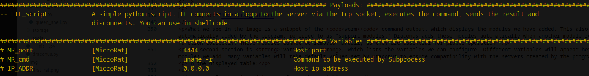

<!DOCTYPE markdown>
<html>
<head>
</head>
<body>

<!-- Projekt: Nazwa i opis projektu -->

    <h1 align="center">Draconus</h1>
    

        
    

    <h4 align="center">Every USER should have a Cyber Weapon to defend himself.</h4>
    
This project serves as a comprehensive toolkit designed to introduce fundamental concepts in ethical hacking and malware creation. It offers tools and functionalities for creating shellcodes, basic malware, code obfuscation, and code packing into single lines, providing an engaging way to explore malware techniques responsibly.

    <h2>Features and Advantages</h2>
    <ul>
        <li><strong>Shellcode Generation</strong>: Create custom shellcodes for testing and experimentation.</li>
        <li><strong>Simple Malware Creation</strong>: Build your own malware and choose the modules yourself.</li>
        <li><strong>Code Obfuscation</strong>: Explore techniques to disguise and modify code to evade detection.</li>
        <li><strong>Code Packing</strong>: Compress scripts into a single line, showcasing payload packing methods.</li>
        <li><strong>Cross-Platform Compilation</strong>: Convert Python scripts to Windows <code>.exe</code> and Linux executables directly from a Linux environment, thanks to emulation and cross-compilers.</li>
        <li><strong>Assembler Program Compilation</strong>: Compile assembly code for both Windows and Linux targets from Linux, eliminating the need for a Windows environment to create ready-to-run executables.</li>
    </ul>

    <h2>Disclaimer</h2>
    

    <strong>This toolkit is developed solely for ethical and educational purposes to deepen understanding of malware creation and analysis. Using this tool to target other users, conduct attacks without prior consent, or apply it in unauthorized environments is strictly forbidden. The responsibility for proper use rests entirely on the user. Caution is advised! Misuse could harm your system or other users. We highly recommend using this tool within isolated virtual machines.</strong>
    

    <h2>⚠️ Important Warning</h2>
    
<strong>It is highly recommended to use Draconus and any worms you create in isolated virtual machines with a dedicated network.</strong>

    
Some modules, such as <code>PyVir</code> or <code>Panther</code>, can infect files or destroy a system after a single execution. The same applies to modules designed for DDOS attacks.

    
Use this tool wisely to avoid unintentionally causing harm to yourself or others.

    <h2>Contents</h2>
    <ul>
        <li><a href="#Draconus">Draconus</a></li>
        <li><a href="#Disclaimer">Disclaimer</a></li>
        <li><a href="#Warning">Important Warning</a></li>
        <li><a href="#About">About Draconus</a></li>
        <li><a href="#Install">Install</a></li>
        <li><a href="#Start">Start</a></li>
        <li><a href="#First_Step">First Step</a></li>
        <li><a href="#Hive">Hive</a></li>
        <li><a href="#MyFirstRat">My First Rat</a>
            <ol><a href="#first_rat">Python RAT</a></ol>
            <ol><a href="#small_worm">Little Worm</a></ol>
            <ol><a href="#two_stage">Two Stage Attack</a></ol>
        </li>
        <li><a href="#AboutProject">About The Project</a></li>
        <li><a href="#Features">Project Features</a></li>
        <li><a href="#Changelog">Changelog</a></li>
    </ul>

    <h2>About Draconus</h2>
    
<strong>Draconus</strong> is a robust program consisting of two sub-programs designed for streamlined server management and client interaction. It offers an automated approach to managing connections, messages, and file transfers without requiring user intervention, making it a powerful tool for ethical hacking and controlled testing environments.

    <h3>Program Structure</h3>
    <ul>
        <li><strong>Background Program</strong>: The first sub-program runs in the background, handling server operations and managing client connections automatically. This design allows for seamless, automated tasks, such as accepting connections, receiving messages, and file handling, all without needing manual input.</li>
        <li><strong>Control Program</strong>: The second sub-program serves as the user interface, connecting to the background program. Built with the <code>Python Click</code> interface, it provides the user with interactive control over various functions, enabling flexible and precise management.</li>
    </ul>
    <h3>Main Sections</h3>
    <ul>
        <li><strong>Main Draconus Section</strong>: Responsible for creating and managing servers, handling connections, and overseeing core operations.</li>
        <li><strong>Hive Section</strong>: Specializes in creating and compiling ready-to-use client programs, making it easy to deploy new clients as needed.</li>
    </ul>

    <h2>Installation</h2>
    <ol>
        <li>Ensure you have Python 3.11.2 or a newer version installed on your system.</li>
        <li>Install Docker (e.g., using the following command):
            <pre><code>sudo apt install docker.io</code></pre>
        </li>
        <li>To allow the program to interact with Docker, you need to set the appropriate permissions. Run:
            <pre><code>sudo usermod -aG docker $USER</code></pre>
            Afterward, log out and back in (or restart your system) to apply the new permissions.
        </li>
        <li>Due to the recent policy changes in Python modules on Linux, make sure you have Python’s virtual environment package, <code>venv</code>, installed. If not, install it with:
            <pre><code>sudo apt install python3.11-venv</code></pre>
        </li>
        <li>Navigate to the <code>Draconus</code> directory:
            <pre><code>cd Draconus</code></pre>
        </li>
        <li>Create a virtual environment:
            <pre><code>python3 -m venv ./venv</code></pre>
        </li>
        <li>Activate the virtual environment:
            <pre><code>source ./venv/bin/activate</code></pre>
        </li>
        <li>Install the project dependencies:
            <pre><code>pip install -r requirements.txt</code></pre>
        </li>
    </ol>
    
The installation is complete, and your environment is ready to use.

    <h2>Getting Started</h2>
    
Before running the program, edit the <code>CONFIG.ini</code> file. This file contains configuration settings with explanations. The main setting to update is <code>IP</code>, where you should enter the IP address of the computer or virtual machine that will run Draconus. After saving your changes, you can proceed with launching the program.

    
<strong>Draconus</strong> consists of two main components: <code>Draconus</code> and <code>Commander</code>. Follow these steps to launch both programs correctly:

    
<strong>Note:</strong> Before launching the programs, you need to activate the virtual environment. Draconus can be run without activating the virtual environment, but Commander requires an active <code>venv</code>. To activate the <code>venv</code>, navigate to the <code>Draconus</code> directory and execute:
        <pre><code>source ./venv/bin/activate</code></pre>
    

    <ol>
        <li><strong>Start Draconus</strong>: Run Draconus with the command:
            <pre><code>python3 Draconus.py</code></pre>
            Since Draconus is designed to operate in the background, you can also launch it as a background process using:
            <pre><code>nohup python3 Draconus.py &</code></pre>
        </li>
        <li><strong>Start Commander</strong>: After Draconus is running, launch Commander with:
            <pre><code>python3 Commander.py</code></pre>
            Commander will attempt to connect to Draconus upon startup. If Draconus is not running, Commander will display an error message and will not launch until it detects an active Draconus instance.
        </li>
    </ol>

    <h2>First Steps</h2>
    
Once Commander has connected to Draconus, you will have access to a console menu resembling a Linux terminal. This interface allows you to manage connections, create servers, and establish direct connections with clients. The <code>help</code> menu is always available, and many commands can be run with the <code>--help</code> parameter for additional assistance.

    <h3>Server Types</h3>
    
You can create four main types of servers:

    <ul>
        <li><strong>Default</strong>: Communicates via TCP socket, with data formatted in JSON and encoded in base64. This server type is recommended for advanced communication, background file transfers, and automated tasks with clients that require no user intervention.</li>
        <li><strong>Raw</strong>: Uses TCP socket but sends raw bytes, allowing for simple message reading and file reception (one at a time) without metadata such as name or type. Ideal for lightweight client programs that don't require complex communication.</li>
        <li><strong>Down</strong>: Designed solely for receiving files, without support for messages, commands, or other functionalities.</li>
        <li><strong>Send</strong>: A server designed only to send files to the client. It does not support messages or commands. When a connection is established, it automatically sends the set files.</li>
    </ul>
    <h3>Make Servers:</h3>
    
Servers can be created using the following format:

    <pre>
    server [name] [port]
    </pre>
    
or:

    <pre>
    server [name] [port] -t [type]
    </pre>
    
For example:

    <pre>
    server my_server 4444 -t raw
    </pre>
    
If you don't specify a server type, the default type will be selected automatically.

    
Servers start automatically after creation and wait for incoming connections from clients. Each server can handle multiple connections simultaneously, so you are not limited to a single connection. Draconus provides access to manage all connected clients, assigning a unique global ID to each client. Servers also automatically detect when a client disconnects and clean up its connection from the program.

    <h3>Exiting the Program</h3>
    
The program can be terminated using two commands: <code>exit</code> or <code>quit</code>.

    <ul>
    <li>
        <strong>exit</strong> - Stops the Commander program. The program closes, but Draconus continues to run in the background. 
        It can still accept connections, send and receive files from clients. 
        When you restart Commander, it will reconnect to the running Draconus, and any pending actions or messages will be displayed on the screen.
    </li>
    <li>
        <strong>quit</strong> - Stops both Commander and Draconus. It sends a termination signal to Draconus, 
        shutting down both programs completely.
    </li>
    </ul>
    <h3>Additional Commands</h3>
    <ul>
    <li>
        <strong>close</strong> - Shuts down the specified server and disconnects all connected clients. 
        For example: <code>close my_server</code>.
    </li>
    <li>
        <strong>task</strong> - Displays all tasks currently being performed by Draconus. 
        These include threads actively running within the program.
    </li>
     <li>
        <strong>conn</strong> - Enters interaction mode with a connected client. 
        This allows you to send commands, files, and more. Each connected client is assigned a unique ID by Draconus, which is used for identification. 
        To initiate communication with a client, use the command <code>conn [ID]</code>, for example: <code>conn 3</code>.
    </li>
    <li>
        <strong>show</strong> - Displays a list of created servers and connected clients.
        <ul>
        <li><strong>-s</strong> - Shows a list of created servers.</li>
        <li><strong>-c</strong> - Displays a list of all connected clients across all servers.</li>
        </ul>
    </li>
    <li>
        <strong>hive</strong> - Accesses a new section of the program with additional commands, menus, and options. 
        This is where you can create worms.
    </li>
    </ul>
    <h3>First Run</h3>
    
When you start Draconus, a directory named <code>OUTPUT</code> will appear in its main directory. This is a critical folder where Draconus stores its logs, downloaded files, created worms, and more. Do not delete this directory while the program is running. You can safely delete it only when both Draconus and Commander are stopped.

    <h4>Contents of the <code>OUTPUT</code> Directory:</h4>
    <ul>
    <li>
        <strong>Logs</strong> - This folder contains log files. Every message displayed by Draconus is saved here, along with a timestamp. 
        Similarly, any message received from clients is also logged.
    </li>
    <li>
        <strong>LOOT</strong> - This folder stores files downloaded from or sent by clients. It will contain subdirectories named after the IP addresses of clients, which will hold the files sent by them. 
        Additionally, a <code>dump</code> subdirectory will store files that could not be identified during download. For example, if a client sends a file without headers or metadata (e.g., name, type), it will end up here. 
        Think of the <code>LOOT</code> folder as the treasure chest for files received from clients.
    </li>
    <li>
    <strong>Hive</strong> - This folder contains files related to worms, source code, shellcodes, and ready-to-use executables. 
    If you create a worm, it will be stored here.
  </li>
  <li>
        <strong>Shortcuts</strong> - This folder provides shortcuts to various useful resources in the project, so you don't have to search for them manually. 
        It includes:
        <ul>
        <li>A folder with icons where you can add your own icons and use them when creating worms.</li>
        <li>A shortcut to files where you can add custom code, for example, to payloads.</li>
        </ul>
  </li>
    </ul>
    
Additional directories may also appear in the <code>OUTPUT</code> folder, depending on the tools you use in Draconus. 
Instructions for new directories will be displayed within the program. Similarly, subdirectories may contain additional files as you use the program. 
For example, many shortcuts in the <code>Shortcuts</code> folder are only created after you access the "hive" section in Draconus.

    <h2>Hive</h2>
    
The <strong>Hive</strong> section is where you create worms. Worms are generated by selecting a main template from the <code>worm</code> section. Depending on the type of worm, some allow the addition of extra modules, payloads, and even code obfuscation, while others only support adding payloads.

    
After selecting the appropriate modules, the process moves to filling out the so-called variables, such as IP address, connection port, and more. Many modules are configurable, and everything is clearly described with example values provided to make configuration straightforward.

    <h3>Main Modules for Building Worms</h3>
    <ul>
    <li>
        <strong>worm</strong> - The main template. This is the first module that must be added. 
        It determines the type of worm you are creating and which additional modules can be used. 
        There are versions that support every type of module, but there are also smaller worms written in assembler, 
        allowing for the addition of simple scripts, and so on. 
        In general, you can create an executable file that weighs over 10 MB or a mini worm with a file size of around 3 KB.
    </li>
    <li>
        <strong>module</strong> - A variety of modules that add different functionalities to your worms. 
        These can include selecting a TCP connection method, connecting via Discord webhook, network scanning, launching a shell, and more. 
        Each module comes with a detailed description of its purpose and functionality.
    </li>
     <li>
        <strong>payload</strong> - Various types of payloads written in Python, PowerShell, or as executable files for testing. 
        Some modules and worms allow embedding a binary (executable) file within the worm itself, which can then be executed later.
    </li>
    <li>
        <strong>shadow</strong> - Code obfuscation options. The final code undergoes various processes to make analysis more difficult. 
        You can use multiple obfuscation modules to make the code even harder to analyze.
    </li>
    <li>
        <strong>starter</strong> - The final method of embedding code into the program. 
        For example, you can choose to place the entire code at the very end, encoded in Base64, and run it as a one-liner.
    </li>
    <li>
        <strong>wrapper</strong> - An additional option that allows embedding the entire worm code into another program. 
        For example, the worm is built using Python modules, but instead of being compiled directly, 
        it is embedded into assembler code. The assembler code is then compiled, and it executes the Python worm code.
    </li>
    <li>
        <strong>process</strong> - Defines the steps the worm will go through until it is fully created. 
        These steps include code generation, obfuscation, adding imports, compilation, and shellcode creation. 
        The processes vary depending on the main worm template. For example, a worm designed for shellcodes 
        will have different steps compared to one created in Python.
        
It is not recommended to modify the default processes unless you are already familiar with the program and understand what you are doing.

    </li>
    </ul>
    <h3>Hive Commands</h3>
    <ul>
    <li>
        <strong>show</strong> - Displays a list with descriptions of available modules. 
         Usage: <code>show [module_type]</code>, e.g., <code>show worm</code>. 
         You must specify the module type, such as <code>worm</code>, <code>module</code>, <code>payload</code>, etc.
    </li>
    <li>
        <strong>add</strong> - Adds a module to your template. 
         Usage: <code>add [module_type] [name]</code>, e.g., <code>add module Binky</code>. 
         The first module to be added must always be one of the main modules, such as <code>worm</code>.
    </li>
    <li>
        <strong>remove</strong> - Removes a specified module from your worm. 
         Usage: <code>remove [module_type] [name]</code>, e.g., <code>remove payload MicroRat</code>.
    </li>
    <li>
        <strong>name</strong> - Sets the name of the worm being created. 
         Usage: <code>name [worm_name]</code>, e.g., <code>name MyFirstWorm</code>. 
         A directory with the worm's name will appear in the <code>Hive</code> folder, where its final files will be stored.
    </li>
     <li>
        <strong>icon</strong> - Sets an icon for the executable file. 
         Usage: <code>icon [file_name]</code>, e.g., <code>icon bee1.ico</code>. 
         You can add additional icons to the folder whose shortcut is located in the <code>Shortcuts</code> directory. 
        Draconus includes several default icons that you can use.
    </li>
    <li>
        <strong>worm</strong> - Displays the entire configuration of the worm being created. 
         Usage: <code>worm</code>.
         It shows added modules, descriptions, required variables to fill in, and more. This is the main command for overseeing the building process.
    </li>
    <li>
        <strong>var</strong> - Sets variables for the worm being created. 
         Usage: <code>var [name] '[value]'</code>, e.g., <code>var ip_addr "192.168.1.1"</code>. 
         Variables depend on the type of worm being created and the modules added. Some modules require additional variables. 
        You can modify all variables listed in the <code>required variables</code> and <code>set variables</code> sections.
    </li>
    <li>
        <strong>rebuild</strong> - Clears all modules and resets the entire worm. 
         Usage: <code>rebuild</code>. 
         This allows you to start a new project from scratch.
    </li>
    <li>
        <strong>comp</strong> - Displays a list of available compilers. 
         Usage: <code>comp</code>. 
         Not all worms can use all compilers. This command lets you view the name and description of each compiler so you can choose the appropriate one for your worm. 
        Worms have default compilers set, such as <code>PyInstaller</code> for Python worms, but you can switch to others, like <code>Nuitka</code>.
    </li>
    <li>
        <strong>install</strong> - Installs the required compilers. 
         Usage: <code>install</code> or <code>install -i [master_compiler_name]</code>. 
         Draconus is installed without compilers by default. You need to install compilers as you use the program. 
        You don't have to install all compilers, especially if you don't plan to create files for certain systems. 
        However, some functionalities, such as building shellcode, are not possible without specific compilers.
        
<strong>Note:</strong> Installing additional compilers involves downloading special Docker images, which can take up extra disk space. 
        For example, the compiler for creating Windows EXE files from Python takes approximately 3.5 GB.

    </li>
    <li>
        <strong>dlc</strong> - Installs additional modules. 
         Usage: <code>dlc -s</code> or <code>dlc -i [dlc_name]</code>, e.g., <code>dlc -i "DLC_1"</code>. 
         Draconus allows adding extra modules over time without requiring you to download or install a new version of the program. 
        To install a DLC, place the package in the <code>IN</code> folder that appears in Draconus's main directory.
    </li>
    <li>
        <strong>sheme</strong> - Displays a list of processes and steps available for worms. 
         Usage: <code>sheme</code>. 
         This is primarily for informational purposes to help you understand the worm-building process if you want to customize it.
    </li>
    <li>
        <strong>gvar</strong> - Displays a list of global options. 
         Usage: <code>gvar</code>. 
         These are special options you can configure, such as changing the default compiler for worms or applying additional compilation options.
    </li>
    <li>
        <strong>setgvar</strong> - Sets a global option. 
         Usage: <code>setgvar [name] [value]</code>, e.g., <code>setgvar COMPILER_NAME WinePyNuitka</code>.
    </li>
    <li>
        <strong>exit</strong> - Exits the Hive console and returns to the Draconus console. 
         Usage: <code>exit</code>.
    </li>
    <li>
        <strong>build</strong> - Starts building the worm into an executable file. 
         Usage: <code>build</code> or <code>build --options</code>, e.g., <code>build --no_compile</code>. 
         If the <code>--no_compile</code> option is used, the executable file will not be created; instead, you will receive a file with the raw code.
    </li>
    </ul>
    
Many commands offer additional help, accessible with the <code>--help</code> option, e.g., <code>build --help</code>.

<h3 id="first_rat">My First Rat</h3>

Below, I will demonstrate how to create simple worms using examples so you can understand the creation process. These are straightforward examples—experimentation is up to you, and who knows, you might come up with something great.
Keep in mind that creating complex worms with multiple modules, obfuscation techniques, and other features can result in a lengthy compilation process. For instance, Nuitka might take around 5 minutes to compile a file on a virtual machine with 4 GB of RAM and a dual-core CPU running at 3 GHz. If you plan to create more resource-intensive worms, consider increasing the resources of your virtual machine.

<h4>Simple python RAT.</h4>

When you are in the HIVE section:

    <ul>
        <li><code>add worm LittleMolly</code> We choose the LittleMolly template, it has spaces for various modules from which we will build the worm.</li>
        <li><code>add module Tcp_v1</code> For communication, we choose the module “Tcp_v1” is the one that allows sending and receiving more complex commands. To handle this module server use the default server in Draconus.</li>
        <li><code>add module Binky</code> We add the “Binky” module, which is a simple RAT, allows you to execute commands on the command line and powershell.</li>
        <li><code>worm</code> We run the “worm” command to see what our worm looks like.</li>
    </ul>
    

        
    

    
What we see in the image is a snippet of the <code>worm</code> command output, which displays the modules we have added. This also includes modules automatically added by the program, referred to as "support modules." Draconus adds these modules automatically when another module requires them to function correctly. These modules cannot be removed manually as they are essential for proper operation.

    
The second section is <strong>"Variables"</strong>, which lists the variables we can configure. Different variables will appear here depending on the modules we add. Many variables will take default values set by Draconus to ensure compatibility with the servers created by the program.

    
In the displayed table:

    <ul>
    <li><strong>First column</strong>: Shows the variable name.</li>
    <li><strong>Second column</strong>: Indicates the module that requires it.</li>
    <li><strong>Third column</strong>: Contains the current value of the variable.</li>
    <li><strong>Fourth column</strong>: Provides a description of the variable.</li>
    </ul>
    
As you can see, the worm automatically retrieved the IP address and other variables directly from Draconus's configuration.

    
If we have all the variables set and the desired modules added, we can proceed to build the worm. To do this, we issue the command: <code>build</code> and wait for the worm to compile. The default compiler is PyInstaller unless we have changed it to another one.

    
Once the program is compiled, a directory with the name of our worm will appear in the OUTPUT/Hive folder. Inside this directory, you will find a file containing the code and the executable file.

     
    <h3 id="small_worm">Small is beautiful, and the smaller, the better</h3>
    
<strong>Creating a small worm:</strong>

    
When you are in the HIVE section:

    <ul>
    <li><code>add worm Lil_Py</code></li>
    </ul>
    
For the main template, we select <code>Lil_Py</code>, which is written in assembler. Its main advantage is that it doesn’t use variables in the code, embedding everything directly on the stack. 
    Additionally, the executable file does not include any extra DLLs, resulting in a very small final file size of just 3-4 KB.

    <ul>
        <li><code>worm</code></li>
    </ul>
     
    

        
    

    
When we issue the <code>worm</code> command, we’ll see that there are no variables to fill in, but there is space for a payload. 
    To add a payload, the module must have space allocated for it. Some modules allow for multiple payloads, and to add them, we can use an additional option in the <code>add</code> command: <code>-t</code>, which lets us place the payload in a specific location.

    
In this example, there is space for only one payload, and from the description, we can see that it must be a payload written in Python. 
    Other types of payloads will not work.

     
    <ul>
        <li><code>add payload MicroRat</code></li>
        <li><code>worm</code></li>
    </ul>
    

        
    

    
After adding the payload, we notice that a section with variables has appeared. Every module, regardless of its type, can have variables that can be modified. 
    Therefore, after adding any module, it’s a good practice to review the entire template using the <code>worm</code> command.

    
Once we have configured the variables as desired, we can proceed with the build process by issuing the <code>build</code> command. 
    After a short while, our small worm should appear in the <code>Hive</code> directory with a size of approximately 3-4 KB. 
    Keep in mind that the larger the scripts you add, the more space the final file will occupy.

     
     
    <h3 id="two_stage">Two Stage Attack</h3>
    
The following steps outline the process for preparing a two-stage attack:

    <ol>
        <li><strong>Create the main worm</strong> that will ultimately be executed on the victim's computer.</li>
        <li><strong>Create a small worm</strong> that will download and execute the main worm.</li>
        <li><strong>Set up a server</strong> for communication with the main worm.</li>
        <li><strong>Create and configure a server</strong> responsible for sending the main worm.</li>
    </ol>
    <h4>Step 1: Create the Main Worm</h4>
    
While in the <strong>HIVE</strong> section, follow these steps:

    <pre>
    add worm LittleMolly
    </pre>
    
We select <code>LittleMolly</code> as the main template because it is ideal for building custom worms.

    <pre>
    add module Binky
    </pre>
    
We add the <code>Binky</code> module, which provides RAT (Remote Access Tool) functionality.

    <pre>
    add module Gyruss
    </pre>
    
We add the <code>Gyruss</code> module, which allows the worm to perform a TCP port scan on the victim's computer or other targets.

    <pre>
    add module Tcp_v1
    </pre>
    
We add the <code>Tcp_v1</code> module to enable TCP communication. This module allows sending commands, receiving messages, and transferring multiple files simultaneously.

    
This is just an example. If you want, you can add other modules, use code obfuscators, and apply a starter.

    <pre>
    worm
    </pre>
    
Finally, we use the <code>worm</code> command to review the current state of our worm configuration.

    

        
    

    
Next, we locate the <strong>Variables</strong> section and observe that our port has a default value (usually <code>4444</code>). Since we will be hosting the main worm on a separate server, we change the port value by issuing the following command:

    <pre>
    var PORT "5555"
    </pre>
    
This sets the <code>PORT</code> variable to <code>5555</code>. Our worm will connect through this port.

    
Once our worm configuration is ready, we start the build process with:

    <pre>
    build
    </pre>
    
Now, we wait for the worm to compile. After a successful build, the compiled worm will appear in the <code>OUTPUT/Hive</code> directory.

    <h4>Step 2: Create the Small Worm</h4>
    
First, we issue the following command to clear the previous configuration and start creating a new worm template:

    <pre>
    rebuild
    </pre>
    
Next, we set a name for the new worm to ensure it doesn’t overwrite the previous one:

    <pre>
    name deliver
    </pre>
    
Here, we named it <code>deliver</code> (you can use any other name). During compilation, a new file will be created instead of replacing the previous worm.

    
We then select the <code>Lil_Py</code> worm template, which is very small and has space for a Python payload:

    <pre>
    add worm Lil_Py
    </pre>
    
Now, we add the <code>PyDelivery</code> payload, a simple script that connects to the server, downloads a file, and executes it:

    <pre>
    add payload PyDelivery
    </pre>
    
To verify our configuration, we use:

    <pre>
    worm
    </pre>
    

        
    

    
If the port value is different from the expected <code>4444</code>, we set it using:

    <pre>
    var PyD_port "4444"
    </pre>
    
Once everything is configured, we proceed with the build process:

    <pre>
    build
    </pre>
    
After a short wait, the compiled small worm will be created in the <code>OUTPUT/Hive</code> directory.

    <h4>Step 3 & 4: Preparing the Servers</h4>
    
Once our worms are ready, we need to prepare the servers. We exit the HIVE console and return to the main Draconus console by issuing:

    <pre>
    exit
    </pre>
    <h5>Creating the Master Server</h5>
    
In the Draconus console, we create the main server that will handle communication with the primary worm:

    <pre>
    server master 5555
    </pre>
    
This command creates a server named <code>master</code> on port <code>5555</code>, which matches the port set in our main worm. We do not specify a server type so that the default type is created, allowing full communication with the worm (enabled by the <code>Tcp_v1</code> module).

    
After issuing this command, you should see a message indicating that the server is ready and listening for incoming connections.

    <h5>Creating the File Delivery Server</h5>
    
Next, we create a server responsible for sending files, which will communicate with the small worm:

    <pre>
    server post 4444 -t send
    </pre>
    
This command creates a server named <code>post</code> on port <code>4444</code> with the <code>send</code> type. This server is specifically designed for file delivery.

    
After creating the <code>send</code> server, a directory named after the server (in this case, <code>post</code>) will automatically appear in the <code>IN</code> folder located in Draconus's main directory.

    
We place the main worm file (built in Step 1) into the <code>post</code> directory. The <code>send</code> server will automatically send any file located in its directory to clients requesting it.

    
Once the servers are ready, we navigate to the main Draconus directory and then to the <code>OUTPUT</code> folder using a file browser or console. From there, go to the <code>HIVE</code> folder where the worms are located.

    
You should see two directories:

    <ul>
    <li><code>MyWorm</code> - Contains the main worm.</li>
    <li><code>deliver</code> - Contains the small worm used to initiate the first stage of the attack.</li>
    </ul>
    
Navigate to the <code>MyWorm</code> directory and copy or move the main worm executable <code>MyWorm.exe</code> to the <code>IN/post</code> folder. Once the worm is placed in this folder, anyone who runs the <code>deliver</code> worm will automatically connect to the <code>post</code> server, download the main worm, and execute it on the target computer.

    <h5>Testing the Attack</h5>
    <ol>
    <li>Start a Windows machine (e.g., a virtual machine).</li>
    <li>Place the <code>deliver.exe</code> worm on the machine and run it.</li>
    <li>After a short while, the main worm will be downloaded and executed. It will appear as a process in the Task Manager.</li>
    </ol>
    

        
    

     
    
In the Draconus console, the <code>master</code> server should accept the connection. You will see a message along with the unique <strong>ID</strong> assigned to the connection.

    
You can now start remote management of the worm by issuing the following command:

    <pre>
    conn [number_ID]
    </pre>
    
For example:

    <pre>
    conn 2
    </pre>
    
Once you enter the client's console, you can execute the following command to retrieve a list of available commands:

    <pre>
    msg help
    </pre>
    
This command sends a request to the worm, asking for the list of commands it supports. The list of commands will depend on how the worm was built, its available options, and the modules used.

    

        
    

     
    <h3>Conclusion</h3>
    
I have demonstrated through examples how to create simple worms. The rest is up to you. Experiment, try new things, and create crazy ideas :)) – who knows, something amazing might come out of it!

    
I’ve spent a lot of time testing the entire project, but despite this, some errors may still occur. Occasionally, a compiler might refuse to cooperate or freeze during compilation (this is rare, but it can happen). If this happens, try compiling the worm again—it should work.

    
Good luck!!

    <h3>About the Project</h3>
    
I understand and acknowledge that the techniques presented in this project are amateur and, for some, may seem primitive. However, I developed this project while teaching myself how all of this is actually created.

    
I do not work in IT and have never worked in the field. I’m not a professional programmer—just a hobbyist. I’m aware that the entire project could probably be done much better: the code could be written more efficiently, better libraries could be used, and so on. But for me, what matters most is that it works.

    
The project will continue to evolve, and over time I plan to add new tools and modules.

    <h2>🚀 Planned Features</h2>
    
In version 1.0, I focused primarily on building and testing Draconus. Less attention was given to creating various modules.

    
In future versions, I plan to add the following:

    <ul>
    <li>More payloads written in PowerShell.</li>
    <li>More Python-based worms with different functionalities.</li>
    <li>Additional types of DDOS attacks.</li>
    <li>Support for building Windows shellcode.</li>
    <li>Ability to create DLL files. - DONE</li>
    <li>More DLL files.</li>
    </ul>

    <h2>Changelog</h2>
    <ul>
        <li>
            <h3>Draconus 1.0</h3>
            
Start Project

        </li>
        <li>
            <h3>Draconus 1.0.1</h3>
            
Improved reading of 'RAW' messages from network sockets.

            
Added payload 'reverse shell' module in python for linux and windows.

        </li>
    </ul>
    <h3>🛠️ Draconus 1.1</h3>
    <ul>
        <li><strong>New payload building system:</strong> Now it's time to come up with something... :)</li>
        <li><strong>Added payload module:</strong> <code>PS_DeliverObf</code> - An obfuscated PowerShell payload with configurable options.</li>
        <li><strong>Added payload module:</strong> <code>PyReverse</code> - A reverse shell written in Python for both Windows and Linux.</li>
        <li><strong>Added main template:</strong> <code>Worm Arkanoid</code> - Enables the creation of DLL files with PowerShell payloads. Additionally, an EXE file is generated to call the payload function. The DLL libraries can be used in any other code.</li>
        <li><strong>Improved raw message handling from sockets:</strong> A message buffer was introduced to prevent the screen from being flooded with hundreds of single-character messages. See <code>CONFIG.INI</code> for more details.</li>
        <li><strong>New functionality:</strong> Automatically prepares a directory with only the necessary files for the worm to operate. If the worm requires several files, a folder with the worm's name is created, containing only the essential files.</li>
        <li><strong>Bug fixes:</strong> Addressed numerous small and significant issues.</li>
    </ul>
    <h2>🛠️ Changelog for Version 1.1.1</h2>
    <ul>
        <li><strong>Added support for special "food" variables:</strong> These contain predefined data such as shellcodes and various worm-related data.</li>
        <li><strong>New worm: <code>WinShell</code> (x86)</strong> - A Windows 32-bit worm designed for testing shellcodes.</li>
        <li><strong>New worm: <code>WinShell64</code> (x64)</strong> - A Windows 64-bit worm designed for testing shellcodes.</li>
        <li><strong>New worm: <code>RiverRaid</code> (x86)</strong> - Hides shellcode among multiple text variables. 
            Generates both an EXE file and a separate DLL with injection functions, making detection more difficult.</li>
        <li><strong>New worm: <code>BrutePID</code> (x86)</strong> - Scans every process PID within a given range and attempts to inject shellcode into one of the processes.</li>
        <li><strong>New cross-compiler: <code>MC_win64</code></strong> - A 64-bit cross-compiler supporting C, C++, and assembler.</li>
        <li><strong>Added text display customization:</strong> In <code>CONFIG.ini</code>, a new option allows adjusting text display for different screen sizes.</li>
        <li><strong>More information added to the "Queen" console commands.</strong></li>
        <li><strong>New DLL building system.</strong></li>
        <li><strong>New wrapper: <code>DropZone</code> (not fully functional)</strong> - An experimental "worm-in-a-worm" system. 
            It embeds a compiled worm inside a "wrapper worm" and attempts to execute it as a separate process. 
            However, it struggles to handle large binary files (several MB). Work is ongoing to resolve this issue.</li>
        <li><strong>Added several new tools</strong> to assist in building different types of worms.</li>
        <li><strong>Bug fixes:</strong> Many small fixes, and probably some new bugs as well! 😄</li>
    </ul>

</body>
</html>
